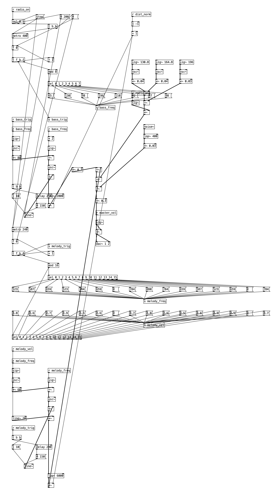
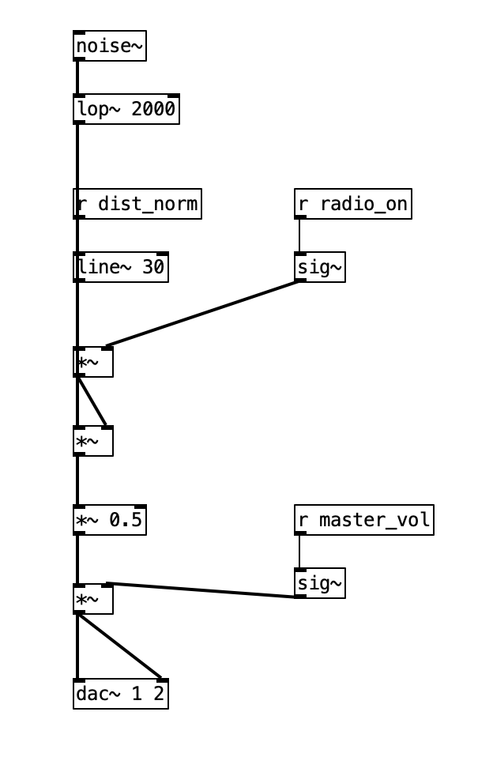
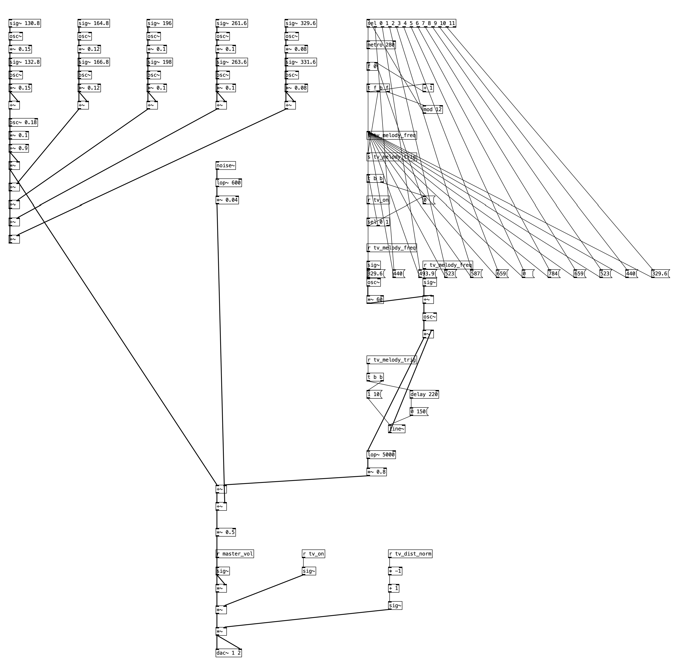

# Living Room Simulator

Scena 3D interactiva a unui living, realizata in **WebGL2**. Aplicatia web permite
utilizatorului sa exploreze incaperea din perspectiva *first-person* si sa
interactioneze cu obiecte care emit semnale **audio** si **video**: un televizor
care reda un clip video (folosit ca textura, incarcata frame cu frame) si un radio
pe care utilizatorul il poate aprinde/stinge si caruia ii poate regla volumul.
Sunetul televizorului si al radioului este spatializat - volumul creste si scade
in functie de distanta camerei fata de sursa.

---

## Cuprins
- [Tema proiectului](#tema-proiectului)
- [Tehnologii, limbaje si API-uri](#tehnologii-limbaje-si-api-uri)
- [Features](#features)
- [Controale](#controale)
- [Rulare](#rulare)
- [Structura proiectului](#structura-proiectului)
- [Descrierea implementarii](#descrierea-implementarii)
  - [Shadere si model de iluminare (Phong)](#shadere-si-model-de-iluminare-phong)
  - [Camera (first-person)](#camera-first-person)
  - [Obiecte, geometrie si texturi](#obiecte-geometrie-si-texturi)
  - [Textura video a televizorului](#textura-video-a-televizorului)
  - [Procesul de desenare (3 treceri)](#procesul-de-desenare-3-treceri)
  - [Sunetul (Pure Data / WebPd)](#sunetul-pure-data--webpd)

---

## Tema proiectului

Simularea interactiva a unui living-room 3D, in care utilizatorul se poate plimba
liber prin camera si poate interactiona cu obiecte "inteligente" (TV si radio) care
produc sunet si imagine. Scopul este integrarea intr-o singura aplicatie web a mai
multor tehnologii: randare grafica 3D in timp real (WebGL2), sinteza si procesare
audio (Pure Data rulat in browser prin WebPd) si redare video ca textura dinamica.

Modelele 3D si texturile sunt reutilizate dintr-un proiect OpenGL / C++ anterior
(vezi `OpenGL_proj/`).

## Tehnologii, limbaje si API-uri

| Categorie | Folosit |
|-----------|---------|
| Grafica 3D | **WebGL2** (`#version 300 es` GLSL) |
| Limbaj | **JavaScript** (client) + **GLSL ES 3.00** (shadere) |
| Biblioteca ajutatoare WebGL | **[twgl.js](https://twgljs.org/)** (Tiny WebGL) - simplifica crearea de buffere, VAO-uri, texturi si setarea uniformelor |
| Audio | **Pure Data (Pd)** + **[WebPd](https://github.com/sebpiq/WebPd)** - ruleaza patch-uri `.pd` in browser peste **Web Audio API** |
| Video | HTML5 `<video>` redat ca textura WebGL (frame cu frame) |
| Server | **Node.js** + **Express** (server static pentru fisiere) |
| Format modele | Wavefront **`.obj`** (parser propriu) |

## Features

- Explorare first-person a intregii camere (deplasare WASD + privire cu sagetile),
  cu limitare (clamp) la pereti si la unghiul de inclinare.
- Iluminare punctiforma (bec in tavan) cu model **Phong** complet (ambient,
  diffuse, specular) calculat in fragment shader.
- Mobilier 3D importat din fisiere `.obj` (canapea, doua fotolii, masa de cafea,
  televizor, radio) plus geometrie procedurala pentru camera si lustra.
- Televizor functional: reda un clip video incarcat frame cu frame ca textura;
  ecranul este *emissive* (pare aprins) si se aude un semnal audio.
- Radio interactiv: butoane ON/OFF si volum reglabil; pe masura ce te indepartezi,
  muzica trece treptat in zgomot static.
- Audio spatializat: volumul TV-ului si al radioului depinde de distanta dintre
  camera si sursa.
- Obiecte transparente: bec, vaza de sticla si geamul ferestrei (blending).
- Umbre proiectate pe podea (shadow projection matrix).
- Texturi pe podea, mobilier si obiecte (tiling, mipmapping).

## Controale

| Tasta / Actiune | Efect |
|-----------------|-------|
| `W` / `S` | Deplasare inainte / inapoi |
| `A` / `D` | Deplasare lateral (strafe) |
| `Up` / `Down` | Privire sus / jos (pitch) |
| `Left` / `Right` | Rotire stanga / dreapta (yaw) |
| Butoane **Radio ON/OFF** | Porneste / opreste radioul |
| Butoane **TV ON/OFF** | Porneste / opreste sunetul televizorului |
| Slider **Master Volume** | Regleaza volumul general |

> Nota: din cauza permisiunilor browserelor, audio-ul porneste doar dupa o
> interactiune a utilizatorului (primul click pe ON). La fel, videoclipul de pe TV
> porneste automat, iar daca browserul blocheaza autoplay, porneste la primul
> click sau la prima tasta apasata.

## Rulare

```bash
# instaleaza dependentele (express, webpd)
npm install

# porneste serverul
node server.js
```

Apoi deschide **http://localhost:3000** in browser.

Serverul Express serveste static fisierele proiectului. Este necesar pentru ca
`fetch` sa poata incarca modelele `.obj`, texturile, videoclipul si patch-urile Pd.

## Structura proiectului

```
PD_FINAL/
├── index.html              # markup: canvas, elementul <video>, panoul audio
├── main.js                 # toata logica WebGL2 + audio (shadere, scena, render, PD)
├── main.css                # stiluri UI
├── server.js               # server Express static
├── lib/
│   └── webpd.min.js        # motorul WebPd (ruleaza patch-uri Pd in browser)
├── Sound_Patches/          # patch-urile Pure Data (.pd) pentru radio si TV
│   ├── radio_music.pd
│   ├── radio_static.pd
│   └── tv_music.pd
├── Models/
│   └── radio/              # modelul .obj + textura radioului
├── OpenGL_proj/            # proiect OpenGL/C++ anterior: sursa modelelor si texturilor
│   ├── *.obj               # canapea, fotoliu, masa, TV, bec, vaza etc.
│   └── Textures/           # texturi (lemn, tesatura canapea, metal etc.)
└── Textures/
    ├── tv_video.mp4        # clipul redat pe ecranul TV
    └── wooden_floor.png
```

---

## Descrierea implementarii

Intreaga aplicatie ruleaza din `main.js`. La pornire (`main()`) se creeaza contextul
WebGL2, se compileaza programul de shadere, se incarca texturile si modelele,
se construieste lista de obiecte din scena (`sceneObjects[]`) si se intra in bucla
de randare (`drawScene` apelat prin `requestAnimationFrame`).

### Shadere si model de iluminare (Phong)

Aplicatia foloseste **2 shadere**: un **vertex shader** si un **fragment shader**.

- **Vertex shader** - aplica transformarile (`worldViewProjection`) asupra
  pozitiilor, transforma normalele cu `worldInverseTranspose` si calculeaza, pentru
  fiecare vertex, vectorii *surface -> light* si *surface -> view* care sunt
  trimisi spre fragment shader.

- **Fragment shader** - implementeaza modelul de iluminare **Phong** cu trei
  componente: **ambient**, **diffuse** si **specular**.

  - **Ambient** ofera un minim de luminozitate tuturor obiectelor, astfel incat si
    fetele care nu sunt lovite direct de raza de lumina sa aiba un minim de
    brightness; altfel acele fete ar aparea complet negre.

  - **Diffuse** simuleaza lumina care loveste o suprafata mata si se imprastie in
    toate directiile. Intensitatea ei depinde doar de pozitia sursei de lumina
    relativ la suprafata: este data de unghiul dintre **normala** suprafetei si
    **vectorul catre sursa de lumina** (`dot(normal, surfaceToLight)`). Cu cat
    unghiul e mai mic, cu atat componenta diffuse e mai mare si suprafata e mai
    luminoasa.

  - **Specular** reprezinta reflexia speculara (ca de oglinda) a luminii. Depinde
    atat de pozitia sursei de lumina, cat si de pozitia camerei (se foloseste
    *half-vector*-ul Blinn-Phong). Este controlata de parametrul **`shininess`**,
    mai mare la materialele lucioase si mai mic la cele mate.

  Culoarea finala combina componentele:
  `baseColor * (ambient + diffuse) + specular`.

Iluminarea este **punctiforma**: o singura sursa de lumina (becul din tavan) la
pozitia `lightLocation = [0, 475, 0]`, cu o culoare usor calda `[1.0, 0.95, 0.89]`.

Fragment shader-ul trateaza si doua cazuri speciale prin uniforme:
- `u_emissive` - obiectul sare peste iluminare si e afisat direct cu culoarea /
  textura lui (folosit pentru ecranul TV, ca sa para "aprins").
- `u_shadowPass` - fragmentul e desenat negru semi-transparent (folosit pentru
  umbre, vezi mai jos).

### Camera (first-person)

Camera este de tip **fly / first-person** si e gestionata in `updateCamera()`.
Directia de privire (`cameraFront`) este reconstruita din unghiurile **yaw** si
**pitch** (coordonate sferice). Tastele `W/A/S/D` muta `cameraPos` de-a lungul
vectorilor front/right, iar sagetile modifica yaw/pitch.

Miscarea este limitata (**clamp**) astfel incat utilizatorul:
- sa nu poata iesi din peretii camerei
  (`X in [-380, 380]`, `Y in [20, 480]`, `Z in [-480, 480]`);
- sa nu poata intoarce privirea peste cap (`pitch in [-89, 89] grade`).

In fiecare frame se construieste matricea de vizualizare cu `m4.lookAt(cameraPos,
cameraPos + cameraFront, cameraUp)` si o matrice de proiectie perspectiva
(`FOV 60 grade`, near 1, far 5000).

### Obiecte, geometrie si texturi

Toate obiectele scenei sunt pastrate in array-ul global **`sceneObjects[]`**.
Fiecare obiect are forma:

```js
{ bufferInfo, vao, worldMatrix, material, transparent?, castShadow? }
```

**Materialul** specifica: culoarea (`u_color`), daca se foloseste textura
(`u_useTexture`), textura propriu-zisa (`u_texture`), `shininess` si `specularColor`.
Obiectele marcate cu `transparent` sunt desenate intr-o trecere separata, iar cele
cu `castShadow` proiecteaza o umbra pe podea.

**Texturile** se gasesc in `OpenGL_proj/Textures/` si `Textures/` si sunt create cu
`twgl.createTexture` (cu `REPEAT`/tiling si mipmapping unde e cazul).

**Modelele** sunt majoritatea importate din fisiere `.obj`:
- **`parseObj`** parseaza un fisier `.obj` (suporta `v`, `vt`, `vn`, fete `f` in
  formatele `v`, `v/vt`, `v//vn`, `v/vt/vn`, inclusiv quad-uri triangulate in
  *fan*) si returneaza trei array-uri: **pozitii**, **normale** si **coordonate de
  texturare**.
- **`loadObjAsMesh`** ia aceste array-uri, creeaza din ele **bufferele** si
  **VAO-ul** corespunzator (cu twgl) si returneaza structura de obiect
  `{ bufferInfo, vao, worldMatrix, material }`.
- **`loadObjSubMesh` / `parseObjByGroup`** permit incarcarea separata a
  sub-obiectelor dintr-un `.obj` (directive `o <nume>`) - folosite la TV, ca sa se
  aplice materiale diferite ecranului si ramei (bezel).

Camera propriu-zisa (podea texturata, tavan, pereti cu fereastra, geam, rama) este
generata **procedural** in `createRoomMeshes()`, prin construirea de quad-uri cu
winding CCW (normale spre interior, pentru `CULL_FACE`). Lustra (conul) si becul
folosesc primitive twgl, respectiv un `.obj`.

### Textura video a televizorului

Ecranul TV foloseste o textura speciala, **`tvVideoTexture`**, care este actualizata
**frame cu frame** din elementul `<video>` definit in `index.html`. In fiecare frame
de randare, daca videoclipul are date disponibile (`readyState >= 2`), se face
upload-ul frame-ului curent in textura cu `twgl.setTextureFromElement(... flipY)`
(flip pe Y deoarece video-urile au originea sus-stanga, iar WebGL esantioneaza de
jos-stanga).

Videoclipul este setat pe `autoplay loop muted`. Daca browserul blocheaza autoplay,
functia **`tryPlayVideo()`** il reporneste la primul click sau la prima tasta apasata.

### Procesul de desenare (3 treceri)

In fiecare frame, lista `sceneObjects` este parcursa in **3 treceri**:

1. **Trecerea A - obiecte opace.** Se deseneaza toate obiectele care **nu** au
   atributul `transparent`. Depth write este activ (`depthMask(true)`), blending
   dezactivat.

2. **Trecerea B - umbre.** Se deseneaza umbrele obiectelor marcate cu `castShadow`,
   proiectate pe podea. `worldMatrix`-ul obiectului este inmultit cu o **matrice de
   proiectie planara** (`shadowMatrix`) care proiecteaza geometria, prin sursa de
   lumina, pe planul podelei (`y = D`). Proiectia trebuie sa fie transparenta, deci
   `depthMask` este dezactivat si `BLEND` activat; in fragment shader umbra e
   desenata cu negru si opacitate `0.9` (`u_shadowPass = 1`), sarind peste iluminare.

3. **Trecerea C - obiecte transparente** (vaza, bec, geam). `depthMask` ramane
   dezactivat (ca sa se vada obiectele din spatele celor transparente) iar `BLEND`
   ramane activat.

La final, starile GL sunt resetate la valorile implicite.

### Sunetul (Pure Data / WebPd)

Sunetul este generat de **patch-uri Pure Data (Pd)** rulate direct in browser cu
ajutorul bibliotecii **WebPd** (`lib/webpd.min.js`). WebPd interpreteaza fisierele
`.pd` si le ruleaza peste **Web Audio API**, fara a fi nevoie de Pd-ul desktop.

Sunt folosite **trei patch-uri** (in `Sound_Patches/`):
- `radio_music.pd` - melodia redata de radio;
- `radio_static.pd` - zgomotul "static" al radioului;
- `tv_music.pd` - sunetul televizorului.

**Fisiere PD:**

#### `radio_music.pd`


#### `radio_static.pd`


#### `tv_music.pd`


**Pornirea motorului audio.** La primul click pe un buton ON se apeleaza
`startPd()`, care executa `Pd.start()` (motorul audio poate porni doar dupa o
interactiune a utilizatorului) si apoi incarca fiecare patch cu
`fetch(...) -> Pd.loadPatch(text)`. Mesajele trimise inainte ca un patch sa termine
de incarcat sunt puse intr-o coada (`pending`) si "golite" (flush) imediat ce
patch-ul e gata.

**Comunicarea JS -> Pd.** Aplicatia trimite parametri catre patch-uri cu
`Pd.send(nume, valoare)`, unde `nume` corespunde unui obiect *receive* din patch:

| Mesaj | Valoare | Semnificatie |
|-------|---------|--------------|
| `radio_on` | `[1]` / `[0]` | porneste / opreste radioul |
| `tv_on` | `[1]` / `[0]` | porneste / opreste sunetul TV |
| `master_vol` | `[0..1]` | volumul general (slider) |
| `dist_norm` | `[val, 50]` | distanta normalizata camera->radio |
| `tv_dist_norm` | `[val, 50]` | distanta normalizata camera->TV |

**Atenuarea in functie de distanta (spatializare).** In fiecare frame, in
`drawScene()`, se calculeaza distanta euclidiana dintre pozitia camerei si pozitia
radioului / televizorului. Aceasta distanta este convertita intr-o valoare
normalizata `dist_norm in [0, 1]` (0 = langa sursa, 1 = departe / inaudibil), pe
baza unei atenuari liniare intre o raza de volum maxim si o raza maxima audibila
(ex.: radio - volum plin sub 50 de unitati, inaudibil peste 600). Valoarea este
trimisa la patch-uri cu un al doilea argument `50` = timpul de *ramp* in
milisecunde, astfel incat schimbarile de volum sa fie line, fara paraituri.
Pentru eficienta, valoarea se trimite doar cand se modifica semnificativ (throttling).

**Crossfade muzica <-> static (radio).** Radioul foloseste doua patch-uri opuse: pe
masura ce te apropii, se aude `radio_music` (volum proportional cu `1 - dist_norm`),
iar pe masura ce te indepartezi, muzica se stinge treptat si creste zgomotul
`radio_static` (volum proportional cu `dist_norm`) - exact ca un radio care "pierde
semnalul". Televizorul are o simpla atenuare cu distanta.

Panoul UI (`#audioPanel`) afiseaza in timp real, prin bare de progres, nivelurile
calculate pentru **Music**, **Static** si **TV Sound**, reflectand valorile trimise
catre Pd.

---

## Demo video

<video src="demo.mp4" controls width="100%"></video>